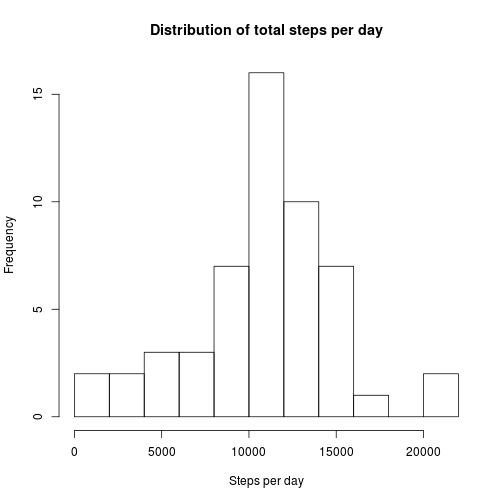
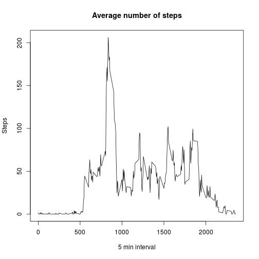
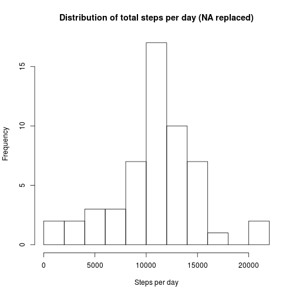
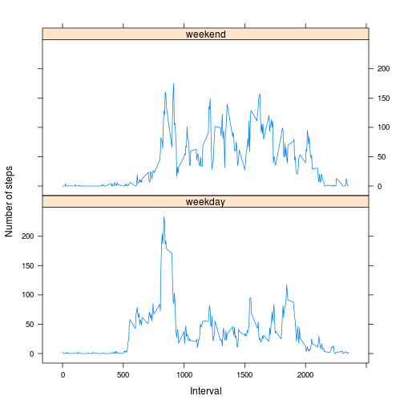

# Reproducible Research: Peer Assessment 1

## Loading and preprocessing the data


```r
unzip("activity.zip")
activity<-read.csv("activity.csv")
```

## What is mean total number of steps taken per day?

* Calculate the total number of steps taken per day


```r
steps_per_day<-aggregate(steps ~ date, data=activity, FUN=sum)
```

* Make a histogram of the total number of steps taken each day


```r
hist(steps_per_day$steps, breaks=10,
     main="Distribution of total steps per day", xlab="Steps per day")
```

 

* Calculate and report the mean and median of the total number of steps taken per day


```r
mean(steps_per_day$steps)
```

```
## [1] 10766.19
```

```r
median(steps_per_day$steps)
```

```
## [1] 10765
```

## What is the average daily activity pattern?

* Make a time series plot (i.e. type = "l") of the 5-minute interval (x-axis) and the average number of steps taken, averaged across all days (y-axis)


```r
steps_per_interval<-aggregate(steps ~ interval, data=activity, FUN=mean)
plot(steps_per_interval, type="l",
     main="Average number of steps", xlab="5 min interval", ylab="Steps")
```

 

* Which 5-minute interval, on average across all the days in the dataset, contains the maximum number of steps?


```r
steps_per_interval$interval[which.max(steps_per_interval$steps)]
```

```
## [1] 835
```

## Imputing missing values

* Calculate and report the total number of missing values in the dataset (i.e. the total number of rows with NAs)


```r
nrow(activity)-sum(complete.cases(activity))
```

```
## [1] 2304
```

* Devise a strategy for filling in all of the missing values in the dataset. The strategy does not need to be sophisticated. For example, you could use the mean/median for that day, or the mean for that 5-minute interval, etc.

The already calculated mean for the 5-minute interval across all days will be used to fill in the missing values.

* Create a new dataset that is equal to the original dataset but with the missing data filled in.


```r
activity2<-transform(activity,
                     steps=ifelse(!is.na(steps),
                                  steps,
                                  steps_per_interval$steps[steps_per_interval$interval==interval]))
```

* Make a histogram of the total number of steps taken each day and calculate and report the mean and median total number of steps taken per day.


```r
steps_per_day2<-aggregate(steps ~ date, data=activity2, FUN=sum)
hist(steps_per_day2$steps, breaks=10,
     main="Distribution of total steps per day (NA replaced)", xlab="Steps per day")
```

 

```r
mean(steps_per_day2$steps)
```

```
## [1] 10766.19
```

```r
median(steps_per_day2$steps)
```

```
## [1] 10765.59
```

* Do these values differ from the estimates from the first part of the assignment? What is the impact of imputing missing data on the estimates of the total daily number of steps?

The values do not differ much from those calculated during the first part of the assginment. The impact over the distribution of total number of steps per day seems low.

## Are there differences in activity patterns between weekdays and weekends?

Use the dataset with the filled-in missing values for this part.

* Create a new factor variable in the dataset with two levels – “weekday” and “weekend” indicating whether a given date is a weekday or weekend day.


```r
activity3<-transform(activity2,
                     day_group=ifelse(weekdays(as.Date(date)) %in% c("Saturday", "Sunday"),
                                      "weekend",
                                      "weekday"))
```

* Make a panel plot containing a time series plot (i.e. type = "l") of the 5-minute interval (x-axis) and the average number of steps taken, averaged across all weekday days or weekend days (y-axis). See the README file in the GitHub repository to see an example of what this plot should look like using simulated data.


```r
steps_per_interval3<-aggregate(steps ~ interval + day_group, data=activity3, FUN=mean)
library(lattice)
with(steps_per_interval3, {
    xyplot(steps ~ interval | day_group, type="l", layout=c(1,2),
           xlab="Interval",ylab="Number of steps")
})
```

 


